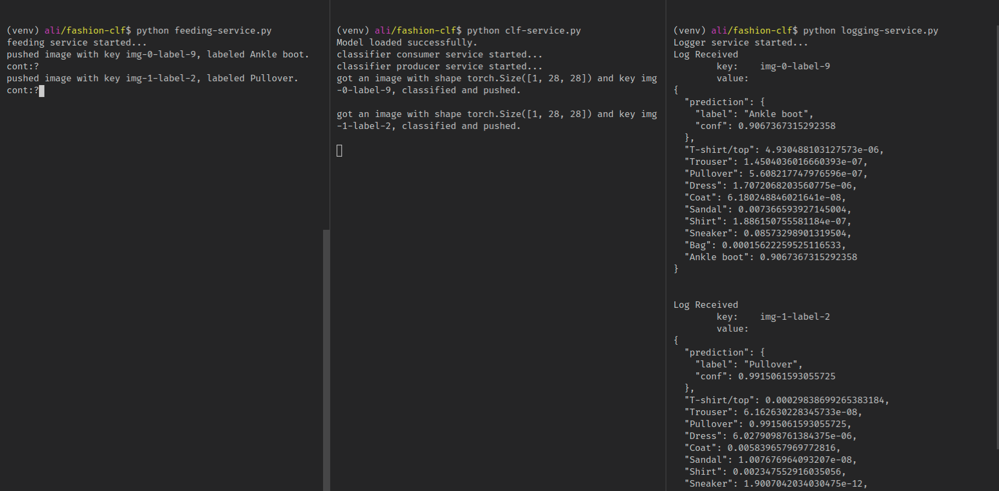

# Fashion MNIST over pubsub

Running an image classifier over a message broker with support to Kafka and Google PubSub.

This repository make use of two other repos:

- [Multi Class Image Classifier](https://github.com/AliAbdelaal/simple-image-classifier)
- [Simple Unified PubSub module](https://github.com/AliAbdelaal/pubsub-lib)

The basic flow of the app is as follows:



1. A producer service produce images (from `torchvision.datasets.FashionMNIST`) and feed it to a topic called `images-topic`, the source code is at `feeding-service.py`.
2. A classifier service consumes the topic `images-topic`, load the images, predict it and publish the results to another topic called `results-topic`, the source code is at `clf-service.py`.
3. A logger service consumes the results of the classifier from `results-topic` and prints it to the console, the source code is at `logging-service.py`.

## Setup

Create a **`python3.7`** virtualenv and install the libraries from `requirements.txt`

```bash
$python -m venv venv
$source venv/bin/activate
$pip install -r requirements.txt
```

Create a `setup.sh` file and fill it with the required env vars those are

- `PUBSUB_CONFIG_PATH` : the path to the configuration files, check [Simple Unified PubSub module](https://github.com/AliAbdelaal/pubsub-lib) for details.
- `GOOGLE_CLOUD_PROJECT`: If yoy are using GCP as a backend.

Run the `setup.sh` file to populate the env vars.

```bash
$source setup.sh
```

Then run the service file that you want. Note that you will need to re-run `source setup.sh` at each new terminal.

## usage

To use the service you will need to create two topics, one for the images to get feeds to, in our example this topic is called `images-topic` and another one for the predictions to get pushed to, in our example this topic is called `results-topic`.
